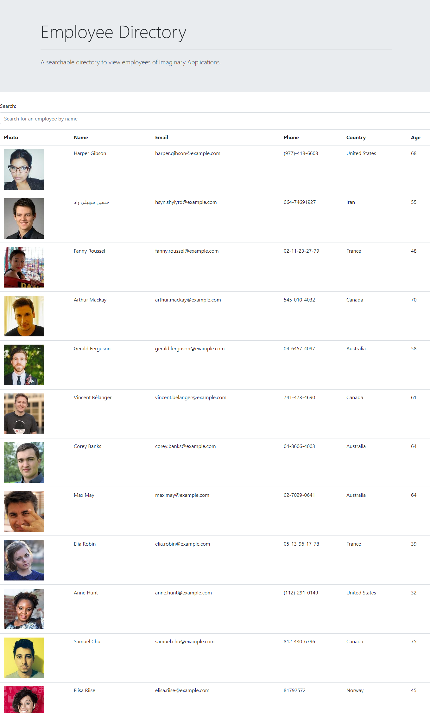

# React-Employee-Directory

## Description

This is an application that allows users to view employees of a company using React. Once the employees are loaded on the page (through componentDidMount), they can be filtered by name, or sorted in the table alphabetically. Users can view some information about employees, like name, email, and age.

[React Employee Directory](https://deck-jessica.github.io/React-Employee-Directory/)

 ## Table of Contents

  *[License](#license)

  *[Installation](#installation)

  *[Contribution](#contributors)

  *[Technologies](#technologies)

  *[Questions](#questions)

## License

## Installation

Once dependencies have been installed, you can begin the application in the terminal with:

`
npm start
`
This will allow you to run it locally in the development state, but it can also be used anywhere via the live link above!

## Contributors

This project was created with the help of my bootcamp class materials and my tutor, as well as some help from AskBCS to get search/filter method working. I have also relied on my study group, and our TA, Jon, to get the sort functionality working as well as help with deploying to GitHub Pages.

## Technologies

This app was made possible with:

*[React.js](https://reactjs.org/)

*[Create React App](https://github.com/facebook/create-react-app)

*[GitHub Pages](https://www.npmjs.com/package/gh-pages)

## Questions

For any questions, you can visit the [GitHub page](https://github.com/deck-jessica).
  Or email directly to [email](mailto:deck.jessica@gmail.com).